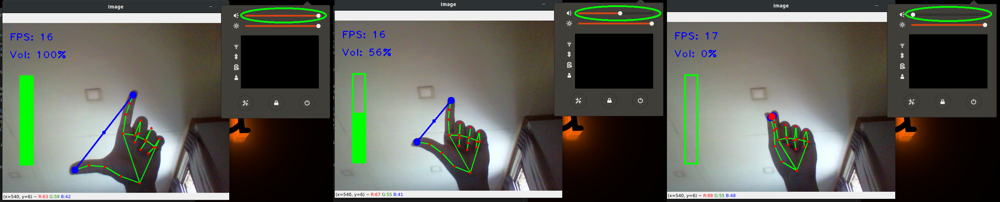

# MediaPipe tutorials
This repo contains simple project files using [MediaPipe](https://google.github.io/mediapipe/)

Customized modules for hand tracking using **MediaPipe** is located in `./Module` folder.

The required packages can be installed:
- pip install opencv-python
- pip install mediapipe

### Volume Control with Hand
Controlling the volume of the system using hand-landmarks. To control the system volume of the Ubuntu from the python script, we will need [alsaaudio](https://pypi.org/project/pyalsaaudio/). 

*If you are using windows, you can use [pycaw](https://github.com/AndreMiras/pycaw) and some lines of code need to be changed*. 

The test code can be run using:
```
python3 Volume_control.py
```


The volume of the system is mapped with the distance between two fingers. You may need to re-map according to your resulution of the webCam.

### Number Count with Finger
Displaying the numbers according to the fingers of the hand. **MediaPipe** detects the land-marks of the finger and the number is counted according the location of the landmarks on camera pixels. To display the finger images according to the results, the images are stored in `Finger` folder.

The test code can be run using:
```
python3 Finger_count.py
```


You can easily add for ***ZERO*** by adding hand picture in the `Finger` folder and only need few lines to change.